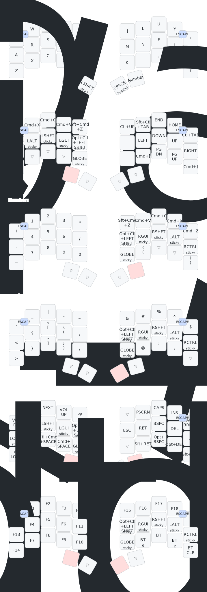

# Windy's zmk-config

## Keymap

- Layers are laid out to reduce the need for chording -- mods are always accessible but not overly relied on
- Mod-morphs are used create shifted characters that make more sense than traditional layouts (e.g. `(` is shifted to `{`, `,` is shifted to `;`, e.t.c.)
- Thumb keys are consistent across all layers
- Thumb shift is used for shifting alpha characters, and homerow Shift is for keyboard shortcuts
- In general, things are kept relatively simple -- complex hold-taps, combos, and behaviors are avoided since Bluetooth keyboards are already plenty finicky

    
### Thumb Cluster

1. The left outer thumb key activates the Navigation layer.

2. The left inner thumb key acts as sticky shift when tapped, and caps-word when double-tapped.

3. The right inner thumb key acts as Space when tapped, and activates the Symbol layer when held.

4. The right outer thumb key activates the Number layer.

When the two outer thumb keys are held (Navigation and Number), the Adjust layer is activated.

When the left outer thumb key and the right inner thumb key (Navigation and Symbol) are held, the System layer is activated.

### Base Layer (Layer 0)

The base layout is Colemak-DH. I use ISO-style punctuation, so `.` and `,` will become `;` and `:` respectively when shifted. `/` has been replaced by `?`, which becomes `!` when shifted. Parens `()`, Hyphen `-`, and Slash `/` are available through combos, as well as on symbol and number layers.

Combos are available by pressing the two outermost keys on each row. For example, by pressing the two keys in the upper right or left corner (`qw` or `y'`), you get Escape.

### Navigation Layer (Layer 1)

The navigation layer provides arrow, navigation, and windowing controls on the right half, and sticky mods on the left side. There's also Miryoku-style convenience shortcuts for cut/copy/paste/undo/redo.

### Number Layer (Layer 2)

The number layer provides a numpad on the left side, and sticky mods on the right side. I've included symbols that make sense in a mathematical context.

### Symbol Layer (Layer 3)

The Symbol layer provides various symbols on the left side, and sticky mods on the right side. 
The right side also has a couple of convenient shifted symbols to reduce the need for shifting keys number on the number layer.

I'm not a programmer or a hardcore Vim-user, so I'm sure this layer isn't as efficient as it   could be.

### Adjust Layer (Layer 4)

The Adjust layer provides access to editing keys Return, Backspace, Delete, Tab, as well as common mod combinations (e.g. Opt+Backspace to delete a full word). Sticky mods as always on the left side. 

There's also convenience shortcuts for things like Spotlight, Force Quit, Screen Lock, media controls, and the Emoji picker

### System Layer (Layer 5)
 
The System layer provides access to Function keys, as well as hardware features such as bluetooth. 