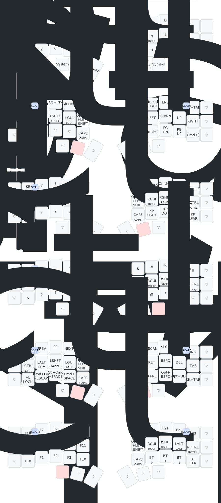

# Windy's zmk-config

I'm an artist and game developer, frequently switching between Windows, macOS, and my iPad. I'm usually using a stylus or pointing device with my left hand, leaving the right hand resting on the keyboard. That being said, the layout is pretty ambivalent and doesn't overly favor one hand over the other.

This layout is a grab-bag of ideas from [callum-oakley](https://github.com/callum-oakley/keymap), [urob](https://github.com/urob/zmk-config), [seniply](https://stevep99.github.io/seniply/), and [Miryoku](https://github.com/manna-harbour/miryoku). 

The layout and shortcuts are macOS-centric. On Windows I use [PowerToys](https://github.com/microsoft/PowerToys) to remap them to their Windows equivalent.

## Keymap

- Convenience shortcuts reduce the need for chording -- mods are accessible across all non-base layers but shortcuts cover common uses
- Mod-morphs are used for more inituitive character shifts (e.g. `(` is shifted to `{`)
- Thumb keys are unchanged across all layers
- Thumb shift is used for shifting alpha characters, and homerow Shift is for keyboard shortcuts
- Simple is better than clever -- complex hold-taps and macros are avoided (Bluetooth keyboards are already plenty finicky)

### Thumb Cluster

1. The left outer thumb key activates the Navigation layer.

2. The left inner thumb key acts as sticky `⇧Shift` when tapped, and [⇪Caps Word](https://zmk.dev/docs/keymaps/behaviors/caps-word) when double-tapped.

3. The right inner thumb key acts as `␣Space` when tapped, and activates the Symbol layer when held.

4. The right outer thumb key activates the Number layer.

When the two outer thumb keys are held (Navigation and Number), the Adjust layer is activated.

When the left outer thumb key and the right inner thumb key (Navigation and Symbol) are held, the System layer is activated.

### Base Layer (Layer 0)

The base layout is Colemak-DH. `/` has been replaced by `?`, which becomes `!` when shifted. Hyphen `-` and Slash `/` are available on the Symbol and Number layers.

#### Mod-Morphs

I use ISO-style punctuation, so `.` and `,` will become `;` and `:` respectively when shifted. This came about when I realized having angle brackets on the base layer made absolutely no sense, which led to wanting combinations that felt more intuitive.

| Symbol | ⇧Shift |
| ------ | ------ |
| ,      | ;      |
| .      | :      |
| ?      | !      |
| ( )    | { }    |
| [ ]    | < >    |

### Homerow Modifiers

CASG - Control Alt Shift GUI

Modifiers are arranged in order of frequency of use on macOS -- Command (GUI) being the most common

I've found Hyper to be inconsistent on Windows, so MEH is used instead.

Caps Lock is used as a modifier. On macOS/iPadOS this key is reassigned to act as the `Globe/Fn` key.

### Navigation Layer (Layer 1)

The navigation layer provides arrow, navigation, and windowing controls on the right half, and sticky mods on the left side. There's also Miryoku-style convenience shortcuts for cut/copy/paste/undo/redo.

### Number Layer (Layer 2)

The number layer provides a numerical keys on the left side, and sticky mods on the right side. I've included symbols that make sense in a mathematical context.

### Symbol Layer (Layer 3)

The Symbol layer provides various symbols on the left side, and sticky mods on the right side.
The right side also has a couple of convenient shifted symbols to reduce the need for shifting keys number on the number layer.

I'm not a programmer or so I'm sure this layer has room for improvement.

### Adjust Layer (Layer 4)

The Adjust layer provides access to editing keys Return, Backspace, Delete, Tab, as well as common mod combinations (e.g. `⌥Option` + `⌫Backspace` to delete a full word). Sticky mods as always on the left side. 

Convenience shortcuts for OS-features include Spotlight, Force Quit, Screen Lock, media controls, and the Emoji picker

### System Layer (Layer 5)

The System layer provides Function keys  as well as hardware features such as bluetooth. I've added extra function keys wherever there was an open spot -- they essentially act as assignable macro keys in whatever software is being used.

What happened to `F13 F14 F15`? On macOS, these keys overlap with PrntScrn, Insert, and PauseBreak. This causes conflicts when assigning them as shortcuts and hotkeys, and therefore  aren't included in the keymap.